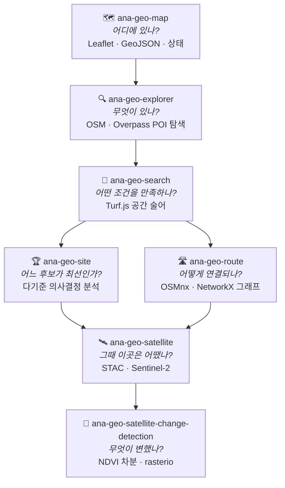
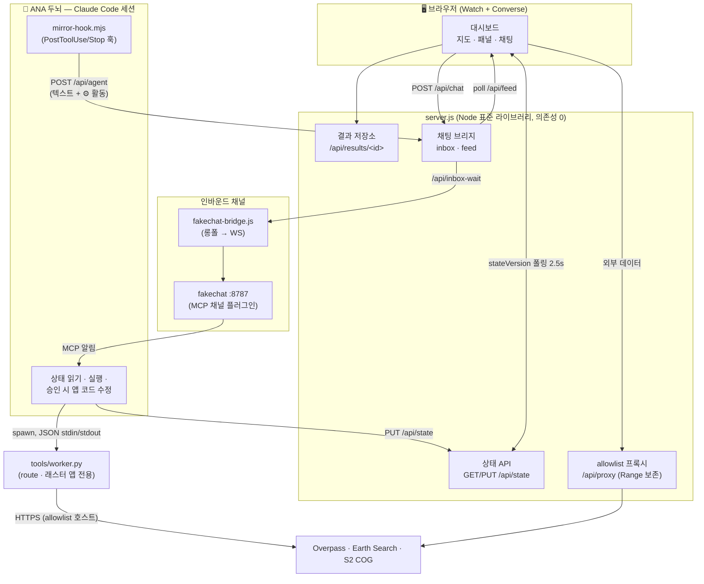
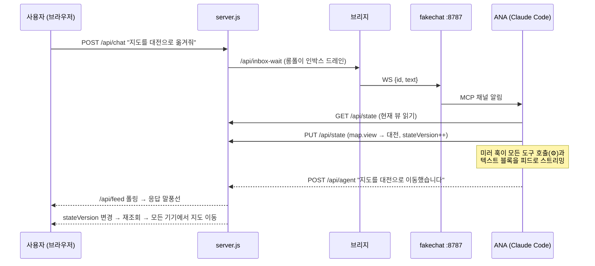
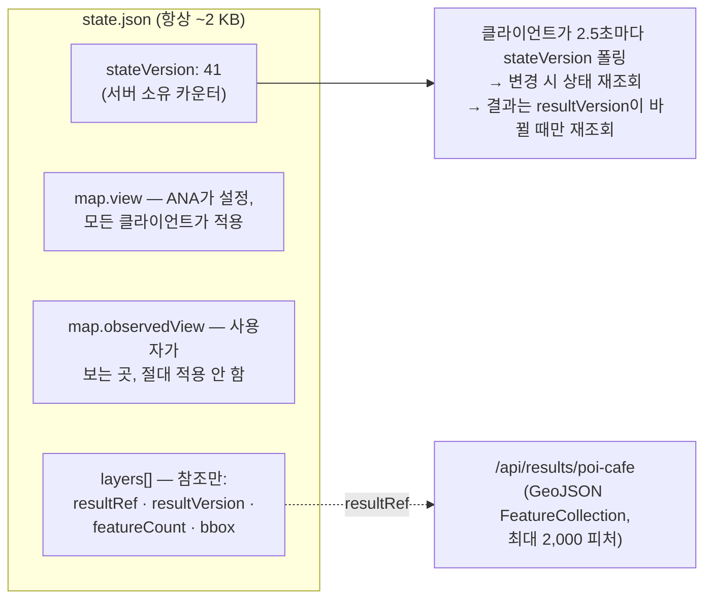
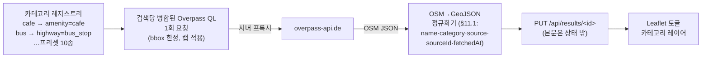
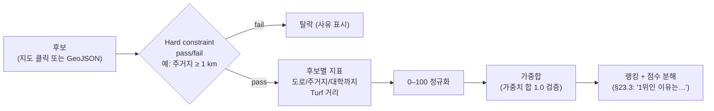
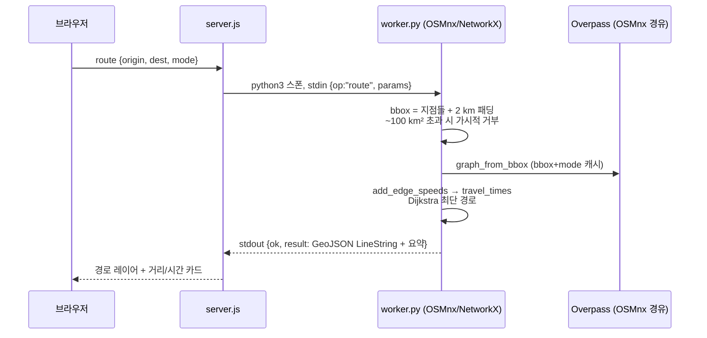
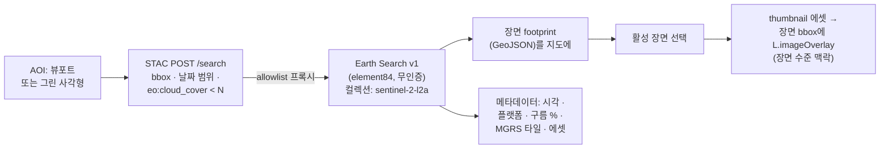
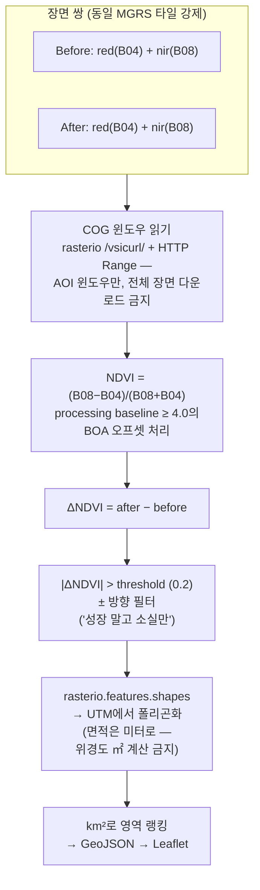

# ANA Geo

[English](README.md) · **한국어**

**Agent-Native GIS** — [ANA(Agent-Native Agent)](https://github.com/tykimos/agent-native-agent) 위에 만든, **보면서 말로 조작하는** 셀프호스팅 지도 앱 패밀리.

에이전트는 GIS에 붙인 챗봇이 아닙니다. **런타임 안에 살면서** 지도 상태를 읽고, 분석을 실행하고 — 앱에 없는 기능을 요청하면 **코드 변경을 제안해 사용 중인 앱을 그 자리에서 진화**시킵니다.

> **Use = Build.**

```text
"지도를 대전으로 옮겨줘"                → 모든 기기에서 지도가 움직임
"대학 2km 안의 카페 찾아줘"             → Turf.js 공간 질의 실행
"베이스맵을 위성영상으로 바꿔줘"         → 앱에 없는 기능 → ANA가 ~15줄 코드 변경을 제안,
                                        승인하면 실행 중인 앱에 기능이 생김
```

---

## 능력 진행 (The capability progression)

독립 실행되는 7개 앱. 각 앱은 이전보다 어려운 지리적 질문에 답하며, 각각이 복제해서 키울 수 있는 완전한 ANA 앱입니다.



| 앱 | 포트 | Geo 능력 | 핵심 기술 |
|---|---|---|---|
| [`ana-geo-map`](apps/ana-geo-map) | 8801 | 벡터 시각화 | Leaflet 1.9.4(벤더링), GeoJSON |
| [`ana-geo-explorer`](apps/ana-geo-explorer) | 8802 | POI 탐색 | Overpass QL, OSM 태그 레지스트리 |
| [`ana-geo-search`](apps/ana-geo-search) | 8803 | 공간 질의 | Turf.js 7(벤더링), 조건 모델 |
| [`ana-geo-site`](apps/ana-geo-site) | 8804 | 의사결정 분석 | MCDA: 제약 → 정규화 → 가중 점수 |
| [`ana-geo-route`](apps/ana-geo-route) | 8805 | 네트워크 분석 | OSMnx 2 + NetworkX (Python 워커) |
| [`ana-geo-satellite`](apps/ana-geo-satellite) | 8806 | 지구 관측 | STAC API, Sentinel-2 L2A, Earth Search |
| [`ana-geo-satellite-change-detection`](apps/ana-geo-satellite-change-detection) | 8807 | 시계열 래스터 분석 | rasterio + NumPy, COG 윈도우 읽기 |
| [`ana-channel-test`](apps/ana-channel-test) | 8808 | — (채널 진단) | 4단계 신호등, 핑 왕복 측정 |

외부 데이터는 전부 **오픈이고 키가 필요 없습니다**: OpenStreetMap, Overpass API, Earth Search STAC(AWS Open Data의 Sentinel-2 L2A).

---

## 런타임 아키텍처

모든 앱은 동일한 무의존 런타임(Node ≥ 20 표준 라이브러리만)을 갖고, 에이전트가 그 **안에** 배선됩니다:



### 대화 한 번의 왕복



### 상태 동기화 (§8.2 + §12)

상태는 에이전트가 읽고 고칠 수 있는 사람이 읽는 JSON 하나이며 — 피처 본문이 절대 안에 살지 않아 항상 **작게** 유지됩니다:



뷰포트 2키 의미론 덕에 *"지도를 대전으로"*는 **모든** 기기를 움직이고, 사용자가 자기 폰에서 팬해도 다른 화면은 끌려가지 않습니다. 연속 제스처는 디바운스(300ms trailing), 이산 액션은 즉시 기록됩니다.

---

## 앱별 Geo 기술

### 🗺 ana-geo-map — 벡터 기초

가장 작은 완전한 Agent-Native GIS. **Leaflet 1.9.4**를 벤더링(CDN 없음 — *Own Your Harness*)하고 OSM 래스터 타일이 베이스맵. 마커와 업로드된 **GeoJSON FeatureCollection**은 서버 상태에 영속되어 모든 기기에서 새로고침을 넘어 유지됩니다. 이후 앱들이 쓰는 모든 것 — 레이어 모델, fit-to-bounds, 클릭→마커 루프 — 이 여기서 시작합니다.

### 🔍 ana-geo-explorer — OpenStreetMap 탐색

지도를 **Overpass API**(OSM 질의 엔진) 위의 탐색 표면으로 바꿉니다:



실측으로 다듬은 디테일: 레지스트리는 함정 태그 `amenity=bus_station`(대전 7건) 대신 `highway=bus_stop`(2,554건)을 쓰고, 공용 인스턴스 부하를 위해 다중 카테고리를 **한** 요청으로 병합하며, 성공 판정을 HTTP 상태로만 하지 *않습니다* — Overpass는 스로틀 시 `200 OK`에 HTML 오류 본문을 돌려줍니다.

### 📐 ana-geo-search — 공간 술어

벤더링한 **Turf.js 7**로 브라우저 안에서 도는 첫 진짜 GIS 분석:

- **술어**: `distance`(하버사인), `buffer`(m/km, 지도에 표시), `booleanPointInPolygon`(within), 거리 이내/이상, 최근접 N
- **조건 모델**(§17.4): `{target, operator: AND|OR, conditions: [{relation, reference, distance, unit}]}` JSON이 상태에 저장 — *"그거 3km로 바꿔줘"*가 질의 재구성이 아니라 **필드 하나** 수정
- Turf 결과를 독립 하버사인 구현과 교차 검증하는 55개 assertion 오프라인 스위트로 검증

### 🏆 ana-geo-site — 다기준 의사결정 분석

공간 필터링이 의사결정 지원으로 자랍니다:



참조 피처는 **feature-class 레지스트리**에서: 도로는 주요 등급 한정(`motorway|trunk|primary|secondary` — 대전 도심 1,544 way vs `highway=*` 21,097), 주거지는 `landuse=residential` — 단 OSM 주거지 커버리지가 성기다는 실측(~10%)을 문서화해 hard constraint의 단독 근거로 쓰지 않습니다.

### 🛣 ana-geo-route — 네트워크 분석 (첫 Python 워커)

도로가 그래프가 됩니다. Node 서버가 JSON stdin/stdout 봉투로 **Python 워커**(`OSMnx 2 + NetworkX + GeoPandas`)를 스폰합니다:



- **최단 거리 & 최단 시간** — `maxspeed` 태그 + 도로 등급별 폴백으로 추정(추정치임을 명시)
- **등시선(isochrone)** — `ego_graph` 시간 컷 + convex hull로 5/10/20분 도달권(*근사*임을 명시)
- **면적 상한** — 초과 요청은 가시적으로 거부(조용한 절단 금지) — "경로 없음"이 항상 진짜 의미가 되도록
- 실검증: 대전 실주행 경로(2,914 m / 209초 / 74좌표)

### 🛰 ana-geo-satellite — 지구 관측 탐색

계정도 API 키도 없이 **STAC**(SpatioTemporal Asset Catalog) 생태계를 검색합니다:



썸네일은 장면 전체 축소판(110 km 타일에 ~343 px ≈ 픽셀당 320 m) — 의도적으로 *분석용이 아닌 장면 수준 시각 맥락*으로 규정합니다. 전체 해상도 COG 렌더링은 에이전트가 요청받으면 구현하는 **진화 요청**입니다.

### 🌱 ana-geo-satellite-change-detection — 시계열 래스터 분석

딥러닝 없이 완결되는 원격탐사 파이프라인:



장면 획득은 앱 **자체** STAC 검색(독립성 규칙 — satellite 앱 import 금지). 합성 래스터 60개 assertion(UTM 52N 픽스처, 면적 소수 넷째 자리 일치)과 워커 봉투 37개 assertion(타임아웃·타일 불일치 거부·오류 표면화)으로 검증했습니다.

---

## 지오 스택 상세

아래 라이브러리는 전부 **앱에 벤더링**(브라우저)되거나 앱별 `requirements.txt`에 고정(Python)됩니다 — CDN도 API 키도 없습니다(*Own Your Harness*).

### 🗺 Leaflet `1.9.4` — 지도 엔진

경량 웹 지도 라이브러리의 사실상 표준(~42 KB gzip). 타일 베이스맵과 벡터 오버레이를 작고 안정적인 API로 렌더링합니다. 사용 기능: 타일 레이어(OSM 래스터), 마커, 피처별 스타일·클릭 이벤트를 갖는 `L.geoJSON`, `fitBounds`, `L.imageOverlay`(위성 썸네일). Mapbox GL/구글맵 대신 택한 이유는 **계정·토큰·빌드 단계가 전혀 필요 없고**(앱마다 JS+CSS 한 쌍 벤더링으로 끝), OpenLayers 대신 택한 이유는 코딩 에이전트가 안전하게 수정할 수 있는 API 단순성입니다. 실측 메모: 기본 SVG 렌더러에서는 레이어당 ~2,000 피처(PRD §26.1)를 넘기기 전에 캔버스/클러스터링으로 전환해야 합니다.

### 🌍 OpenStreetMap — 세계의 오픈 지리 데이터베이스

도로·건물·POI·토지이용을 담은 크라우드소싱 지리 데이터(ODbL 라이선스). ANA Geo는 세 경로로 소비합니다: **래스터 타일**(베이스맵 — 브라우저 직접 요청을 허용하는 유일한 외부 호출), **Overpass 질의**(POI·도로·토지이용), **OSMnx 그래프 다운로드**(도로망). 대전 실측 메모: OSM 커버리지는 고르지 않습니다 — `landuse=residential` 폴리곤이 측정한 도심 bbox의 ~10%만 덮어서, OSM 유래 주거지 거리를 pass/fail 제약의 단독 근거로 쓰면 안 됩니다(site 앱 주의사항).

### 🔍 Overpass API — OSM 질의 엔진

OSM 데이터 전용 읽기 질의 서비스로, 자체 언어 **Overpass QL**을 씁니다: 요소 필터(`node["amenity"="cafe"](bbox)`)를 기술하면 일치 요소를 OSM JSON으로 돌려줍니다. 우리는 항상 앱 `server.js`의 allowlist 프록시를 경유하고, 여러 카테고리를 **한** 요청으로 병합하며, 모든 질의를 bbox와 요소 캡으로 한정합니다. 실전에서 배운 것들: 공용 인스턴스는 클라이언트당 ~2 동시 슬롯이고 한도를 넘으면 **HTTP 200 + HTML 오류 본문**으로 답하거나(성공 판정은 상태 코드가 아니라 파싱으로) 부하 시 504/502를 냅니다; 태그 선택이 결정적입니다(대전에서 `highway=bus_stop` 2,554건 vs `amenity=bus_station` 7건); 응답은 GeoJSON이 아니라 OSM JSON이라 각 앱이 §11.1 형태(`name / category / source:"osm" / sourceId / fetchedAt`)로 만드는 소형 정규화기를 동봉합니다.

### 📐 Turf.js `7` — 브라우저 공간 분석

브라우저에서 GeoJSON을 직접 다루는 모듈형 공간 분석 라이브러리. 의존 모듈: `distance`(하버사인), `buffer`(m/km), `booleanPointInPolygon`, `nearestPoint`, `pointToLineDistance`, `pointToPolygonDistance` — 마지막 것은 **Turf ≥ 7.3 필수**라 버전 하한이 중요합니다(site 앱의 후보-경계 거리 계산). 실측 메모: `buffer`는 평면 근사(도시 스케일 무방, 대형·고위도에서 왜곡)이고, 면적 계산은 절대 위경도 도 단위로 하지 않습니다 — 재투영하거나 측지 헬퍼를 씁니다.

### 🛣 OSMnx `2` + NetworkX + GeoPandas — 도로망을 그래프로 (Python)

**OSMnx**는 bbox/지명의 도로망을 OSM에서(내부적으로 Overpass 경유) 내려받아 실제 도로 기하를 갖는 **NetworkX** 유향 그래프로 만듭니다. `add_edge_speeds`/`add_edge_travel_times`는 `maxspeed` 태그에서 속도를 추정하고 누락 구간은 도로 등급별 평균으로 채웁니다(그래서 소요 시간은 추정치이며, 그렇게 표기합니다). **NetworkX**가 알고리즘을 맡습니다: 라우팅은 Dijkstra 최단 경로, 등시선은 travel-time 반경의 `ego_graph` + 헐 근사(*approximate* 명기). **GeoPandas**는 OSMnx의 기하 처리를 받칩니다. 실측 메모: 도시 규모 `graph_from_bbox`는 수십 초·수백 MB가 될 수 있어 분석 면적 ~100 km² 상한, bbox 2 km 패딩, `(bbox, network_type)` 그래프 캐시를 두며, 진짜 병목은 공용 Overpass 엔드포인트입니다(한 측정 세션에서 8회 중 5회 실패).

### 🛰 STAC + Earth Search — 위성 영상 찾기

**STAC**(SpatioTemporal Asset Catalog)은 지리공간 자산을 기술하는 JSON 명세입니다 — 모든 장면은 footprint 기하·시각·속성(`eo:cloud_cover` 등)·*에셋*(밴드 파일, 썸네일)을 가진 *Item*이고, 검색은 bbox + 날짜 범위 + 속성 필터의 `POST /search` 한 번입니다. 기본 공급자로 **Earth Search v1**(`earth-search.aws.element84.com`, Element 84 운영)을 고정한 이유는 **검색과 에셋 다운로드가 모두 무키**인 드문 카탈로그이기 때문입니다. 일부 에셋 링크는 requester-pays `s3://`라서 항상 공개 `https://` href를 씁니다. 실측 메모: `thumbnail` 에셋은 있지만 `overview` 에셋은 존재하지 않으며, 썸네일은 장면 전체 축소판(110 km 타일에 ~343 px ≈ 픽셀당 320 m)이라 장면 수준 맥락 전용입니다.

### 🌱 Sentinel-2 L2A — 영상 그 자체

ESA의 광학 지구관측 위성군: 우리가 쓰는 밴드는 10 m 해상도, ~5일 재방문, 무료·공개. **L2A**는 대기 보정된 지표 반사율(BOA)로, 지수 계산에 맞는 처리 수준입니다. NDVI는 `red`(B04)와 `nir`(B08), 둘 다 10 m. 우리가 처리하는 함정 두 가지: 장면은 **MGRS 타일**로 잘려 있어 동일 타일 쌍은 픽셀 그리드를 공유하지만 타일이 다르면 재투영이 필요하고(v1은 명시적으로 거부), processing baseline ≥ 4.0은 **BOA 오프셋**(−1000)을 더해 두므로 STAC 메타데이터가 미조화라고 말할 때 되돌려야 합니다.

### 🧮 rasterio + NumPy — 세상을 통째로 안 받는 래스터 연산

**rasterio**(GDAL의 Python 바인딩)가 Sentinel-2 **COG**(Cloud-Optimized GeoTIFF — 내부 타일링 덕에 HTTP `Range` 요청으로 원하는 윈도우만 받을 수 있는 GeoTIFF)를 읽습니다. `/vsicurl/`로 각 밴드의 AOI 윈도우만 읽으므로 ~700 MB 장면 대신 수 KB~수 MB면 됩니다 — §8.4 프록시가 `Range` 헤더를 무변경 전달해야 하는 이유가 이것입니다. **NumPy**가 배열 연산(NDVI, 차분, 임계)을 맡고, `rasterio.features.shapes`가 변화 마스크를 폴리곤화합니다. 철칙: 면적은 타일의 UTM 좌표계(미터)에서 계산하고 위경도에서는 절대 하지 않습니다.

### 📄 GeoJSON — 공용어

RFC 7946. ANA Geo의 모든 벡터 결과 — 마커·POI·버퍼·경로·footprint·변화 폴리곤 — 는 GeoJSON `FeatureCollection`으로 정규화되어 어느 레이어든 어느 앱으로든, 그리고 곧바로 Leaflet 위로 흐릅니다. PRD에도 명시된 영원한 함정 하나: GeoJSON 좌표는 **`[lon, lat]`**, Leaflet API는 **`[lat, lon]`** — 변환은 렌더 경계에서만 합니다.

---

## 공유 계약 (PRD §8)

독립된 7개 앱을 하나의 시스템으로 느끼게 하는 것:

| 계약 | 보장 내용 |
|---|---|
| **§8.2 상태 동기화** | 서버 소유 단조 `stateVersion`; 2.5초 폴링으로 전 기기 수렴; 300ms 제스처 디바운스; `resultVersion` 변경 전파 |
| **§8.3 Converse 배선** | 채팅 → 인박스 → **릴레이/브리지**(폴링은 릴레이 몫, 에이전트가 아님) → 세션; 응답은 항상 대시보드 피드로 |
| **§8.4 외부 데이터 프록시** | 브라우저는 서드파티 직접 호출 금지; 앱별 호스트 allowlist; **`Range`/`206` 무변경 전달**로 래스터 부분 읽기 보존 |
| **§8.5 Python 워커** | `spawn python3 tools/worker.py`, 봉투 `{op, params}` → `{ok, result, error:{code,message}}`, 60초 타임아웃, 실패 가시화 |
| **§9 독립성** | 앱마다 `node server.js`; 컨벤션은 앱 간 **복사, import 금지** |
| **§12 참조 전용 레이어** | 피처 본문은 `/api/results/<id>` 뒤에 — 2,000피처 검색에도 상태는 1.4 MB가 아니라 ~2 KB |

---

## 앱 실행

```bash
cd apps/ana-geo-map
node server.js                    # 대시보드 → http://localhost:8801
```

Node ≥ 20 (표준 라이브러리만 — Leaflet/Turf는 앱별 벤더링). Python 앱 2개는 추가로:

```bash
python3 -m venv .venv && .venv/bin/pip install -r requirements.txt   # route, change-detection
```

### 두뇌 연결 (*agent-native*로 만들기)

```bash
# 최초 1회: claude plugin install fakechat@claude-plugins-official
./brain.sh                # ① 고아 정리 기동기 → claude --channels plugin:fakechat@…
node fakechat-bridge.js   # ② 대시보드 인박스 → fakechat WS → 세션
```

각 앱의 `CLAUDE.md`가 세션에 ANA 역할을 가르치고, **미러 훅**(`.claude/settings.json` + `tools/mirror-hook.mjs`)이 세션의 도구 활동(⚙)과 모든 텍스트 블록을 대시보드 피드로 스트리밍합니다 — 최종 메시지의 배달 보증 watcher 포함.

**왕복이 안 될 때**: 진단 앱을 띄우세요:

```bash
cd apps/ana-channel-test && node server.js    # → http://localhost:8808
```

실시간 신호등 4개(서버/브리지/fakechat/두뇌 — **`:8787` 고아 프로세스 감지** 포함), 핑 왕복 측정, 페이지 안의 전체 트러블슈팅 가이드.

---

## 데모 시나리오 (대한민국 대전)

한 도시, 일곱 개의 질문 — 지도 위 점 하나가 시계열 분석으로 자라는 과정:

```text
map        "대전으로 이동해줘"
explorer   "대학과 카페를 찾아줘"
search     "대학 2km 안의 카페를 찾아줘"
site       "대학 접근성·도로·주거지 이격으로 후보지 순위를 매겨줘"
route      "이 후보지에서 가장 가까운 간선도로나 역까지 최단 경로"
satellite  "이 지역의 저운량 Sentinel-2 영상을 찾아줘"
change     "6개월 전 영상과 비교해줘"
```

---

## 문서

| 문서 | 내용 |
|---|---|
| [`PRD.md`](PRD.md) | 제품 요구사항 v1.2 — 7개 앱 70개 FR, 공유 계약, 수용 기준 |
| [`PRD-REVIEW.md`](PRD-REVIEW.md) | 3라운드 다중 에이전트 검수(FAIL → CONDITIONAL PASS, critical 4→0, major 38→21), 라운드별 finding 계보 |
| [`DESIGN_SYSTEM.md`](DESIGN_SYSTEM.md) | 토스 스타일 토큰 시스템(라이트+다크), 레이아웃 골격, 접근성 규칙 — ANA 베이스 `uxui-design-system` 기반 |
| 앱별 `SPEC.md` | FR을 인용하는 수용 기준의 15절 명세 |
| 앱별 `README.md` | 실행법, 예시 프롬프트, 한계, 다음 진화 |

## 라이선스

베이스 프로젝트 참조: [agent-native-agent](https://github.com/tykimos/agent-native-agent).
