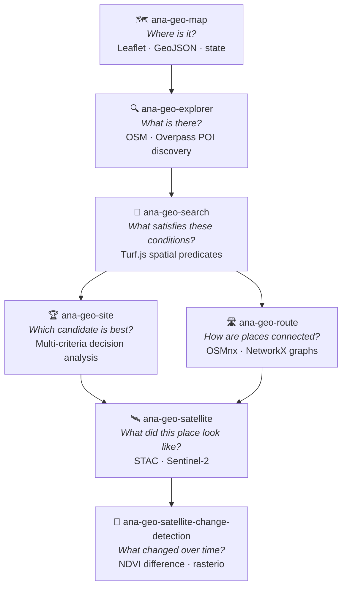
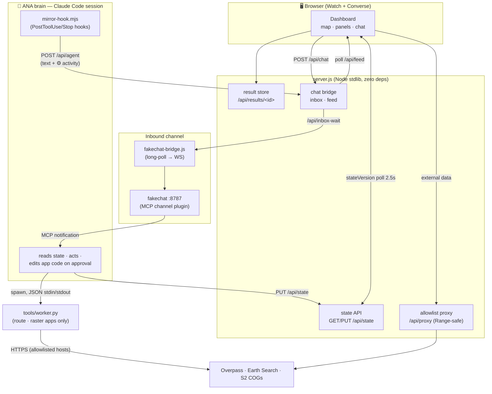
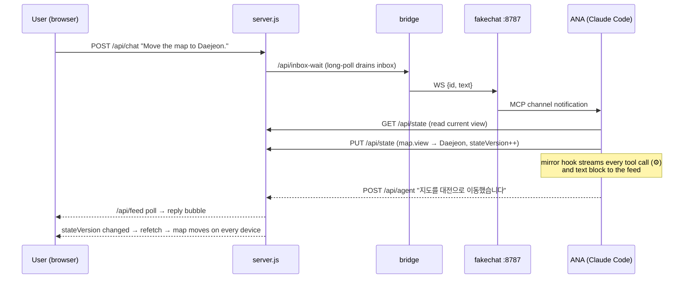
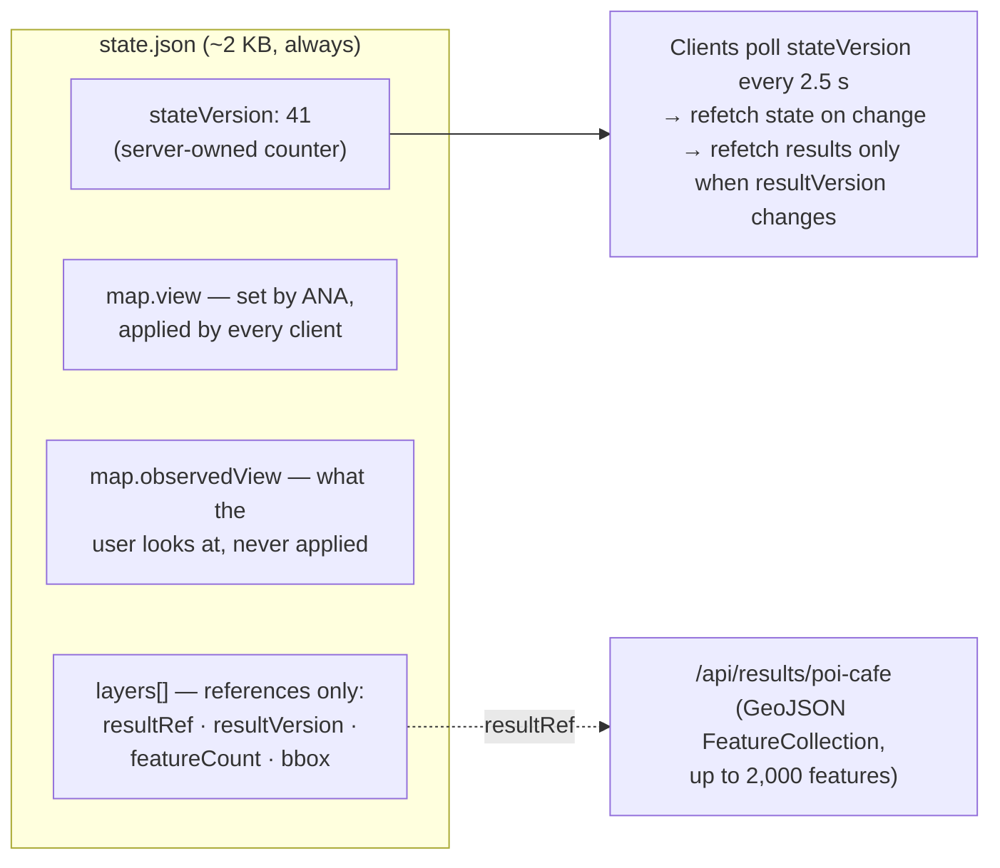
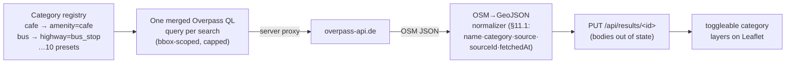
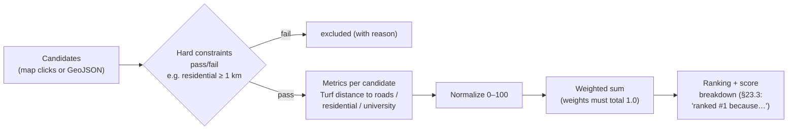
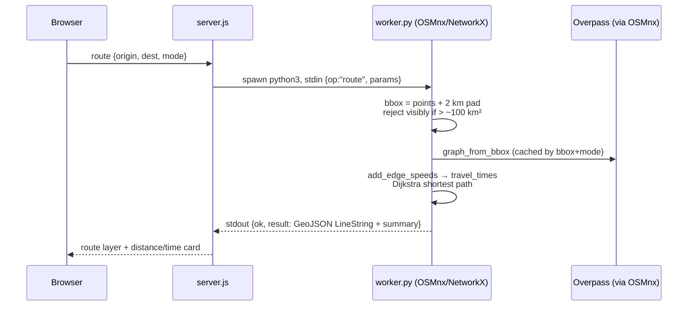
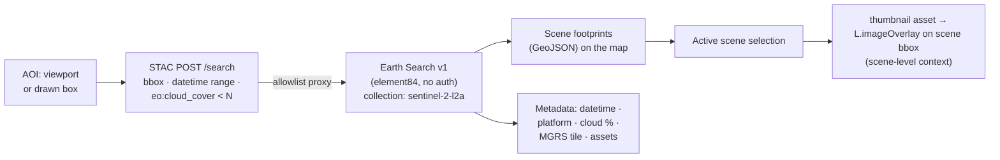
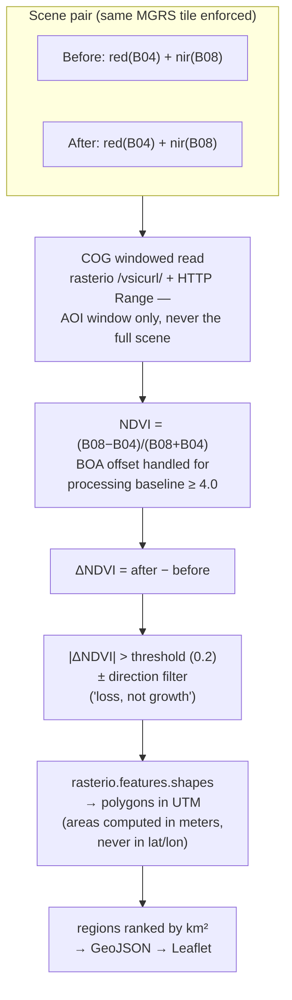

# ANA Geo

**Agent-Native GIS** — a family of self-hosted map applications you operate by **watching and talking**, built on [ANA (Agent-Native Agent)](https://github.com/tykimos/agent-native-agent).

The agent is not a chatbot bolted onto a GIS. It lives **inside the runtime**: it reads the map state, runs the analysis, and — when you ask for something the app can't do — **proposes a code change and evolves the app while you're using it**.

> **Use = Build.**

```text
"Move the map to Daejeon."            → the map moves, on every device
"Find cafes within 2 km of a university."  → Turf.js spatial query runs
"Switch the basemap to satellite."    → the app lacks it → ANA proposes ~15 lines,
                                        you approve, the running app gains the feature
```

---

## The capability progression

Seven independently runnable apps. Each answers a harder geographic question than the last, and each is a complete ANA app you can clone and grow.



| App | Port | Geo capability | Key tech |
|---|---|---|---|
| [`ana-geo-map`](apps/ana-geo-map) | 8801 | Vector visualization | Leaflet 1.9.4 (vendored), GeoJSON |
| [`ana-geo-explorer`](apps/ana-geo-explorer) | 8802 | POI discovery | Overpass QL, OSM tag registry |
| [`ana-geo-search`](apps/ana-geo-search) | 8803 | Spatial queries | Turf.js 7 (vendored), condition model |
| [`ana-geo-site`](apps/ana-geo-site) | 8804 | Decision analysis | MCDA: constraints → normalize → weighted score |
| [`ana-geo-route`](apps/ana-geo-route) | 8805 | Network analysis | OSMnx 2 + NetworkX (Python worker) |
| [`ana-geo-satellite`](apps/ana-geo-satellite) | 8806 | Earth observation | STAC API, Sentinel-2 L2A, Earth Search |
| [`ana-geo-satellite-change-detection`](apps/ana-geo-satellite-change-detection) | 8807 | Temporal raster analysis | rasterio + NumPy, COG windowed reads |
| [`ana-channel-test`](apps/ana-channel-test) | 8808 | — (channel diagnostics) | 4-stage traffic lights, ping round-trip |

All external data is **open and key-free**: OpenStreetMap, Overpass API, Earth Search STAC (Sentinel-2 L2A on AWS Open Data).

---

## Runtime architecture

Every app ships the same zero-dependency runtime (Node ≥ 20 stdlib only) with the agent wired **inside** it:



### One conversational round-trip



### State synchronization (§8.2 + §12)

State is a single human-readable JSON that the agent can inspect and edit — and it stays **small** because feature bodies never live inside it:



Two-key viewport semantics mean *"Move the map to Daejeon"* moves **every** device, while a user panning their own phone never drags another screen. Continuous gestures are debounced (300 ms trailing); discrete actions write immediately.

---

## Geo tech, app by app

### 🗺 ana-geo-map — vector foundation

The smallest complete Agent-Native GIS. **Leaflet 1.9.4** is vendored (no CDN — *Own Your Harness*), OSM raster tiles are the basemap, markers and uploaded **GeoJSON FeatureCollections** persist in server-side state and survive refreshes on every device. Everything later apps need — the layer model, fit-to-bounds, the click→marker loop — starts here.

### 🔍 ana-geo-explorer — OpenStreetMap discovery

Turns the map into a discovery surface over **Overpass API** (the OSM query engine):



Field-tested details: the registry uses `highway=bus_stop` (2,554 hits in Daejeon) instead of the trap tag `amenity=bus_station` (7 hits); multiple categories merge into **one** Overpass request to respect the public instance's rate limits; and success is *never* judged by HTTP status alone — Overpass returns `200 OK` with an HTML error body when throttled.

### 📐 ana-geo-search — spatial predicates

The first real GIS analysis, entirely in the browser with vendored **Turf.js 7**:

- **Predicates**: `distance` (haversine), `buffer` (m/km, drawn on the map), `booleanPointInPolygon` (within), within/outside distance, nearest-N
- **Condition model** (§17.4): a JSON query — `{target, operator: AND|OR, conditions: [{relation, reference, distance, unit}]}` — stored in state, so *"change that to 3 km"* edits **one field** instead of rebuilding the query
- Verified by a 55-assertion offline suite that cross-checks Turf against an independent haversine implementation

### 🏆 ana-geo-site — multi-criteria decision analysis

Spatial filtering grows into decision support:



Reference features come from the **feature-class registry**: roads restricted to major classes (`motorway|trunk|primary|secondary` — 1,544 ways in central Daejeon vs 21,097 for `highway=*`), residential areas from `landuse=residential` — with a documented caveat that OSM residential coverage is sparse (~10% measured), so it must not be the sole basis of a hard constraint.

### 🛣 ana-geo-route — network analysis (first Python worker)

Roads become a graph. The Node server spawns a **Python worker** (`OSMnx 2 + NetworkX + GeoPandas`) over a JSON stdin/stdout envelope:



- **Shortest distance & shortest time** — travel times estimated from `maxspeed` tags with per-road-class fallbacks (declared as estimates)
- **Isochrones** — 5/10/20-minute reachable regions via `ego_graph` travel-time cutoff + convex hull (explicitly *approximate*)
- **Area cap** — an oversized request is rejected with a visible error (never silently truncated), so "no route" always means what it says
- Verified live: a real Daejeon drive route (2,914 m / 209 s / 74-point geometry)

### 🛰 ana-geo-satellite — Earth observation discovery

Search the **STAC** (SpatioTemporal Asset Catalog) ecosystem without any account or API key:



The thumbnail is a whole-scene preview (~343 px for a 110 km tile ≈ 320 m/pixel) — deliberately labeled *scene-level visual context, not analysis-grade imagery*. Full-resolution COG rendering is an **evolution request** the agent can implement on demand.

### 🌱 ana-geo-satellite-change-detection — temporal raster analysis

The full remote-sensing pipeline, no deep learning required:



Scene acquisition is the app's **own** STAC search (per the independence rule — no imports from the satellite app). Verified by a 60-assertion synthetic-raster suite (UTM 52N fixtures, area accuracy to the 4th decimal) plus 37 worker-envelope assertions covering timeouts, cross-tile rejection, and error surfacing.

---

## Shared contracts (PRD §8)

What makes seven independent apps feel like one system:

| Contract | What it guarantees |
|---|---|
| **§8.2 State sync** | Server-owned monotonic `stateVersion`; 2.5 s polling converges every device; 300 ms gesture debounce; `resultVersion` bumps propagate |
| **§8.3 Converse wiring** | chat → inbox → **relay/bridge** (the relay polls, never the agent) → session; replies always land in the dashboard feed |
| **§8.4 External data proxy** | The browser never calls third-party APIs; per-app host allowlist; **`Range`/`206` forwarded intact** so raster partial reads survive |
| **§8.5 Python worker** | `spawn python3 tools/worker.py`, envelope `{op, params}` → `{ok, result, error:{code,message}}`, 60 s timeout, visible failures |
| **§9 Independence** | `node server.js` per app; conventions are **copied, never imported** across apps |
| **§12 Reference-only layers** | Feature bodies live behind `/api/results/<id>` — a 2,000-feature search leaves state at ~2 KB instead of 1.4 MB |

---

## Run any app

```bash
cd apps/ana-geo-map
node server.js                    # dashboard → http://localhost:8801
```

Node ≥ 20 (stdlib only — Leaflet/Turf are vendored per app). The two Python apps additionally need:

```bash
python3 -m venv .venv && .venv/bin/pip install -r requirements.txt   # route, change-detection
```

### Wire up the brain (make it *agent-native*)

```bash
# once: claude plugin install fakechat@claude-plugins-official
./brain.sh                # ① orphan-safe launcher → claude --channels plugin:fakechat@…
node fakechat-bridge.js   # ② dashboard inbox → fakechat WS → session
```

Each app ships a `CLAUDE.md` that teaches the session its ANA role, and a **mirror hook** (`.claude/settings.json` + `tools/mirror-hook.mjs`) that streams the session's tool activity (⚙) and every text block into the dashboard feed — including a delivery-guarantee watcher for the final message.

**Something not round-tripping?** Run the diagnostic app:

```bash
cd apps/ana-channel-test && node server.js    # → http://localhost:8808
```

Four live traffic lights (server / bridge / fakechat / brain — including **orphaned `:8787` process detection**), a ping round-trip timer, and the full troubleshooting guide on the page.

---

## Demo scenario (Daejeon, Republic of Korea)

One city, seven questions — the same place growing from a dot on a map to a temporal analysis:

```text
map        "Move to Daejeon."
explorer   "Find universities and cafes."
search     "Find cafes within 2 km of a university."
site       "Rank candidate locations using university proximity, roads, and residential separation."
route      "Find the fastest route from this candidate to the nearest major road or station."
satellite  "Find a low-cloud Sentinel-2 image for this area."
change     "Compare it with an image from six months earlier."
```

---

## Documents

| Doc | What's in it |
|---|---|
| [`PRD.md`](PRD.md) | Product requirements v1.2 — 70 FRs across 7 apps, shared contracts, acceptance criteria |
| [`PRD-REVIEW.md`](PRD-REVIEW.md) | 3-round multi-agent review (FAIL → CONDITIONAL PASS, critical 4→0, major 38→21) with per-round finding lineage |
| [`DESIGN_SYSTEM.md`](DESIGN_SYSTEM.md) | Toss-style token system (light+dark), layout skeleton, a11y rules — from the ANA base `uxui-design-system` |
| per-app `SPEC.md` | 15-section spec with FR-cited acceptance criteria |
| per-app `README.md` | run instructions, example prompts, limitations, next evolution |

## License

See the base project: [agent-native-agent](https://github.com/tykimos/agent-native-agent).
