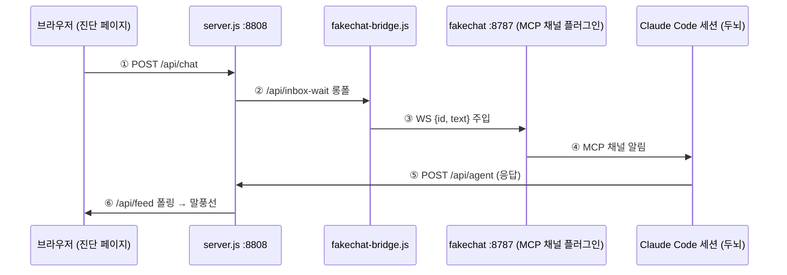

# ana-channel-test

대시보드 ↔ 브리지 ↔ fakechat ↔ Claude Code 세션의 **채팅 왕복을 단계별로 진단**하는 유틸리티 앱. ANA Geo 앱들의 Converse 배선(§8.3)과 동일 계약을 쓰므로, **여기서 왕복이 되면 다른 앱에서도 됩니다.**

진단 페이지: `http://localhost:8808` (신호등 4개 + 핑 왕복 측정 + 페이지 내 트러블슈팅)

## 연결 경로 (무엇을 진단하나)



신호등 1~4가 각각 ①/②/③/⑤ 구간의 생사를 실시간으로 보여줍니다.

## 전체 절차 — 처음부터 왕복 성공까지

### 0. 사전 준비 (최초 1회)

```bash
claude plugin install fakechat@claude-plugins-official
```

### 1. 앱 서버

```bash
cd apps/ana-channel-test
node server.js                    # → http://localhost:8808
```

브라우저에서 페이지를 열면 **신호등 1(앱 서버)**이 초록이 됩니다.

### 2. 두뇌 세션 기동 — 반드시 채널을 물고

```bash
./brain.sh
```

`brain.sh`가 하는 일: 8787을 점유한 **고아 fakechat**(부모가 launchd인 bun)을 먼저 정리한 뒤 `claude --channels plugin:fakechat@claude-plugins-official`를 실행합니다. 채널은 **세션 기동 시점에만** 붙습니다 — 플래그 없이 띄운 세션에 나중에 붙일 방법은 없습니다.

세션이 뜨면 배너에 다음 문구가 보여야 합니다:

```
Channels (experimental) messages from plugin:fakechat@claude-plugins-official inject directly in this session
```

### 3. `/mcp`로 채널 연결 확인 ★

배너는 "플래그를 줬다"는 뜻일 뿐, **fakechat 서버가 실제로 살았는지는 보장하지 않습니다.** 세션 안에서:

```
/mcp
```

| /mcp 표시 | 의미 | 조치 |
|---|---|---|
| `fakechat` **connected** | 채널 정상 — 4단계로 진행 | — |
| `Failed to reconnect to plugin:fakechat:fakechat: -32000` | fakechat 서버가 기동 직후 죽음. 거의 항상 **고아 프로세스의 8787 선점(EADDRINUSE)** | 아래 확인 후 세션 재시작 |

`-32000`이 보이면:

```bash
lsof -iTCP:8787 -sTCP:LISTEN -n -P     # 점유 프로세스 확인
ps -o ppid= -p <PID>                    # 부모가 1(launchd)이면 이전 세션이 남긴 고아
kill <PID>                              # 고아 제거
# 세션 exit 후 ./brain.sh 로 재기동 (brain.sh가 위 과정을 자동으로 해줌)
```

> 💡 **페이지 신호등 3이 `/mcp`를 대신합니다.** 서버가 fakechat MCP 기동 로그(`~/Library/Caches/claude-cli-nodejs/…/mcp-logs-plugin-fakechat-fakechat/`)를 직접 읽어, 마지막 기동이 실패면 "MCP 기동 실패: EADDRINUSE …(어느 앱 세션인지, 몇 시인지)"를 표시합니다 — 세션에 들어가지 않고도 같은 판정을 볼 수 있습니다. 8787 점유 프로세스의 고아 여부(부모 launchd)도 함께 표시됩니다.

### 4. 브리지 (별도 터미널)

```bash
node fakechat-bridge.js
```

`[bridge] fakechat 연결됨: ws://127.0.0.1:8787/ws` 로그가 뜨고 **신호등 2**가 초록이 됩니다. ("fakechat 끊김, 2s 후 재접속" 루프가 돌면 문제는 브리지가 아니라 3단계입니다.)

### 5. 왕복 확인 — 🏓 핑 테스트

페이지의 **핑 테스트** 버튼을 누르면 `[ping-…]` 메시지가 전 구간을 돌아 세션에 도착하고, 세션이 `[pong …]`을 `POST /api/agent`로 회신하면 왕복 시간이 표시되며 **신호등 4**가 초록이 됩니다. (핑 응답 규칙은 이 디렉토리의 `CLAUDE.md`가 세션에 자동으로 가르칩니다 — 별도 지시 불필요.)

핑이 성공하면 배선 완성입니다. 이제 자유 메시지로 대화하면 되고, 같은 배선이 모든 ANA Geo 앱에서 동작합니다.

## 트러블슈팅 요약 (상세는 페이지에)

| 증상 | 원인 | 해결 |
|---|---|---|
| `/mcp`에 `-32000` | 고아 bun의 8787 선점 → EADDRINUSE | `kill <고아 PID>` 후 `./brain.sh` 재기동 |
| 배너는 떴는데 세션이 조용함 | 위와 동일 (fakechat만 죽은 상태) | 신호등 3 문구 확인 → 동일 조치 |
| 메시지는 세션에 도착, 응답이 페이지에 없음 | 세션이 채널 `reply`로만 답함 | 응답은 `POST /api/agent`(필드 `text`) — `CLAUDE.md` 로드 여부 확인 |
| 중간 과정·최종 응답 누락 | 미러 훅 미로딩/유실 | 세션 재시작(훅은 기동 시 로드) · 로그 `/tmp/ana-channel-test-mirror.log` |
| 어디서 끊겼는지 모름 | — | 채널 직접 주입으로 이분 탐색: `curl -s -X POST localhost:8787/ -F 'id=diag-1' -F 'text=진단'` → 세션에 뜨면 앱/브리지 쪽, 안 뜨면 세션/채널 쪽 |

## 구성 요소

- `server.js` — 진단 페이지 + 채팅 브리지 + `/api/health`(브리지 롱폴 감지 · fakechat 리스너/고아 판별 · **MCP 기동 로그 판독** · 두뇌 응답 최근성)
- `brain.sh` — 고아 정리 + 채널 세션 기동기
- `fakechat-bridge.js` — 인박스 → fakechat WS (소비형 인박스 보호 큐 내장)
- `CLAUDE.md` — 두뇌 역할(핑→퐁 규칙 포함) 자동 주입
- `tools/mirror-hook.mjs` + `.claude/settings.json` — 세션 활동(⚙)·텍스트를 페이지로 미러(최종 메시지 배달 보증 watcher 포함)

Node ≥ 20 (브리지는 전역 WebSocket 때문에 22 권장), npm 의존성 0. 이 앱은 PRD의 7개 GIS 앱 패밀리에 속하지 않는 진단 도구입니다(SPEC.md 없음).
