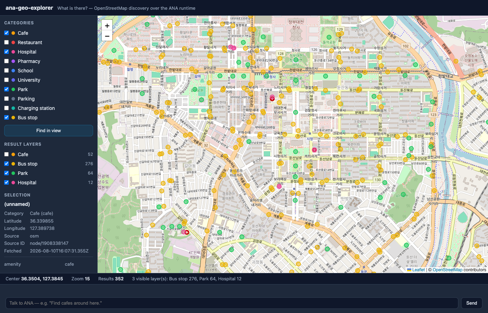

# ana-geo-explorer

Discover what actually exists on the map: tick POI categories, search the visible area against OpenStreetMap, and talk to ANA about the results.



**Core question:** *What is there?*

## Run

```bash
node server.js          # dashboard + state + chat bridge + Overpass proxy → http://localhost:8802
node relay.js           # inbound relay (separate process) — pushes chat to the ANA session
```

Requires **Node.js >= 20 LTS**. Zero npm dependencies (Leaflet is vendored in `vendor/leaflet/`). The app runs standalone — it imports nothing from `ana-geo-map` (PRD §9).

To act as ANA, run a coding agent (e.g. Claude Code) in this directory; it receives user messages from `relay.js` output (or `data/inbox.log`), edits `state.json` / the app code, and replies with `POST /api/agent`.

## Dependencies

- Node.js >= 20 LTS (global `fetch`)
- Leaflet 1.9.4 (vendored)

No Python, no npm install, no conversion library — OSM JSON → GeoJSON is hand-written in `geo/overpass.js`.

## External data sources

- **Overpass API** (`https://overpass-api.de/api/interpreter`) — all POI data. The browser never calls it directly; every query is a `POST /api/proxy` against the server allowlist `ALLOWED_HOSTS = ['overpass-api.de']` (PRD §8.4).
- OpenStreetMap raster tiles (basemap only).

Data © OpenStreetMap contributors, ODbL. Overpass is a free shared instance: one search sends **one** merged query for all selected categories, capped at 2,000 features.

## Example prompts

```text
"Find cafes around here."
"Show schools too."
"Hide cafes."
"Show only hospitals."
"Find parks in the visible area."
"Where are the charging stations near here?"
"Add convenience stores as a category."          ← evolution: ANA proposes a registry change
"Show me only the cafes within 300 m of a park." ← beyond this app: ANA proposes the next step
```

## Current capabilities

Ten POI presets in one canonical registry (`geo/registry.js`): cafe, restaurant, hospital, pharmacy, school, university, park, parking, charging station, bus stop. Viewport-bounded Overpass search merging every selected category into a single request; results become per-category GeoJSON layers with counts, colours, independent visibility toggles, and click-through detail (name, category, coordinates, full OSM tag list, source ID). Feature bodies are stored server-side and referenced from `state.json`, so state stays small and syncs to every device via `stateVersion` polling. ANA can set the categories and trigger a search by bumping `search.requestId` — the map updates without a reload.

Note on the "bus station" preset: it is realized as `highway=bus_stop`, not `amenity=bus_station`. The latter means the terminal building and returns only 7 objects across all of Daejeon, which is not what "find bus stations near here" means to a user.

## Limitations

- **Can discover objects, but cannot evaluate spatial relationships** — there is no "within 300 m of", "nearest", or multi-condition query. That is the next app.
- All geometry is normalized to points: a park polygon is shown as its `center`, so area and shape are lost.
- Overpass is a public instance with no SLA. Rate limits and timeouts happen, and it returns HTTP 200 with an HTML body when overloaded — the app detects this and says so, but it cannot prevent it. Wide viewports with many categories fail more often; zoom in and retry.
- Results are capped at 2,000 features per search; beyond that the set is truncated (reported on the Watch surface), not paged.
- Searches are one-shot snapshots — nothing refreshes as the map moves, and results are never cached between runs.
- `map.observedView` is a single slot — with multiple devices, the last writer wins.
- Approval cards render as plain feed messages in this first version.

## Next evolution

**`ana-geo-search`** — *"What is near what?"* Adds spatial predicates (distance, buffer, within, within/outside distance, nearest) and multi-condition AND/OR search over the layers this app discovers.
