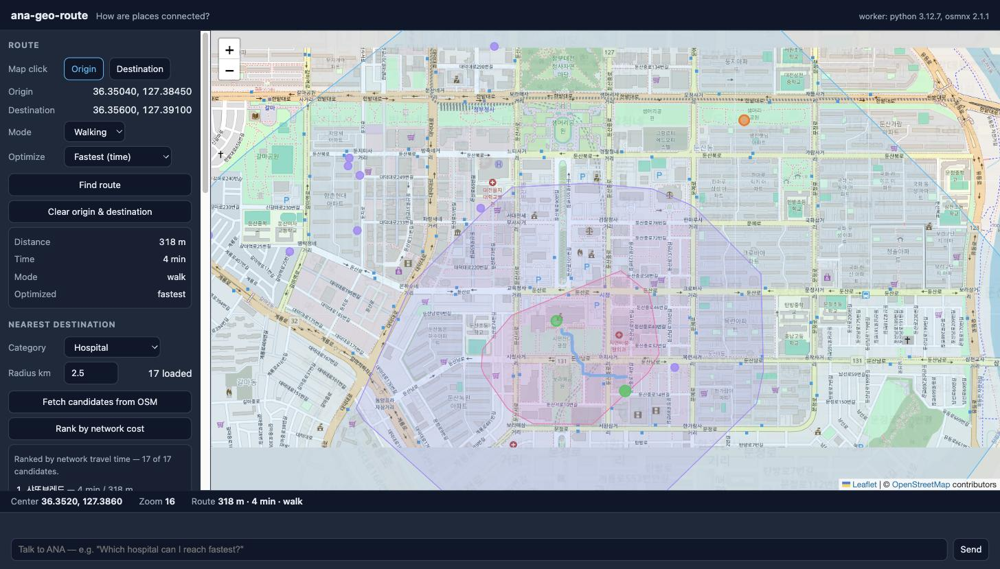

# ana-geo-route

Routing over a real OpenStreetMap road network, computed by a **Python worker** and driven by conversation.



**Core question:** *How are places connected?*

This is the first app in the series whose analysis does not run in the browser. Node collects the question, a short-lived Python process answers it with OSMnx and NetworkX, and the browser draws the result.

## Run

```bash
python3 -m venv .venv
.venv/bin/pip install -r requirements.txt   # osmnx, networkx, geopandas — a few minutes

node server.js          # dashboard + state + chat bridge + worker  → http://localhost:8805
node relay.js           # inbound relay (separate process) — pushes chat to the ANA session
```

Requires **Node.js >= 20 LTS** and **Python >= 3.10** (osmnx 2.x drops 3.9). `server.js` uses `.venv/bin/python` when that venv exists and falls back to `python3` otherwise; the header of the dashboard shows which interpreter answered and which dependency versions it found. No npm dependencies (Leaflet is vendored in `vendor/leaflet/`).

To act as ANA, run a coding agent (e.g. Claude Code) in this directory; it receives user messages from `relay.js` output (or `data/inbox.log`), edits `state.json` / the app code, and replies with `POST /api/agent`.

### Tests

```bash
.venv/bin/python tools/smoke_worker.py   # 66 offline checks — no network, no Overpass
node tools/smoke_envelope.js             # 8 checks of the §8.5 envelope round trip
```

## Dependencies

- Node.js >= 20 LTS (global `fetch`)
- Python >= 3.10 with `requirements.txt` — `osmnx>=2.0`, `networkx>=3.0`, `geopandas>=1.0`
- Leaflet 1.9.4 (vendored)

## External data sources

- **OpenStreetMap road networks** via the Overpass API, downloaded inside the Python worker by OSMnx and cached as GraphML under `data/cache/`
- **OpenStreetMap POIs** via Overpass through the server proxy, used as candidate destinations
- **OpenStreetMap raster tiles** (basemap only; © OpenStreetMap contributors)

The host allowlist is `overpass-api.de`, declared once in `server.js` and re-checked inside the worker against the endpoint OSMnx is configured to use.

## Example prompts

```text
"Route from here to the station."
"Use walking instead."
"Which cafe can I reach fastest?"
"Show the area reachable within 10 minutes."
"Give me the shortest route, not the fastest one."
"Raise the area cap to 300 km²."
"Avoid this road."               ← evolution: ANA proposes a code change
```

## Current capabilities

Click-to-set origin and destination; driving, walking and cycling modes; shortest-distance and shortest-time routes computed together so both numbers are visible; route drawn as a GeoJSON `LineString` with a distance/time/mode summary; candidate destinations fetched by category from Overpass and ranked by network travel time or distance, with the winner's route drawn; approximate 5/10/20-minute isochrones; road networks bounded by the origin/destination/target bbox plus 2 km padding, capped at 100 km² and cached by (bbox, network type, speed model); every worker failure surfaced with its code and numbers, and persisted in `state.json` so it survives a refresh.

## Limitations

- **Depends on the public Overpass API.** The first, uncached network download for an area takes seconds and occasionally longer than the 60 s worker timeout when the public endpoint is busy; a retry usually succeeds because OSMnx caches the HTTP response. There is no private endpoint and no rate-limit budget.
- **Travel times are estimates, never measured.** For driving, edges without an OSM `maxspeed` tag are given the mean speed of their road type — in central Daejeon that is roughly 88% of edges. For walking and cycling a single speed is assumed for the whole network (4.8 and 15 km/h), because OSM `maxspeed` describes motor traffic; gradient, crossings, signals and waiting time are not modelled.
- **Isochrones are approximate by construction.** Each band is the convex hull of the reachable intersections, so it bridges gaps the network cannot actually cross (rivers, rail corridors) and over-covers. The polygons are labelled `approximate` in the result, in state, and in the tooltip.
- **The 100 km² cap is small on purpose, and a 20-minute driving isochrone does not fit inside it** (it needs roughly 700 km²). The request is refused with the requested area and the cap rather than silently clipped; raise `analysis.areaCapKm2` to run it, and expect a much slower download.
- Routes snap to the nearest intersection, and the snap distance is reported — for a point in the middle of a block that can be ~100 m.
- No turn restrictions, one-way exceptions for cycling, elevation, or traffic. `avoid this road` is not implemented; it is the worked example of an evolution.
- The candidate ranking routes at most 60 destinations per run; when more are loaded, the truncation is stated in the panel rather than hidden.

## Next evolution

**`ana-geo-satellite`** — *"What does it look like from above, and when?"* Leaves vector networks for Earth observation: STAC search over Sentinel-2, scene footprints, cloud-cover filtering, and choosing a moment in time rather than a path through space.
