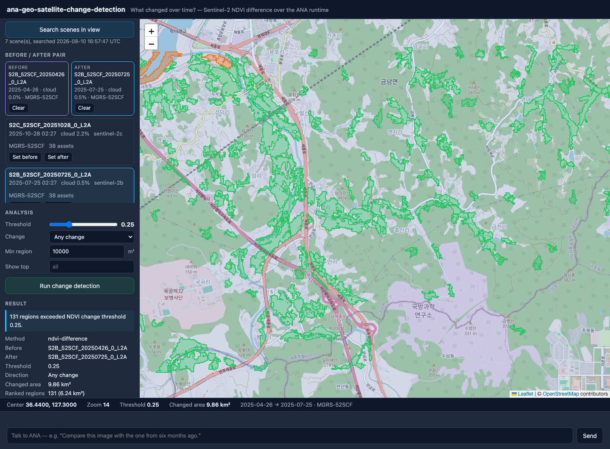

# ana-geo-satellite-change-detection

Compare two Sentinel-2 scenes of the same place and see what changed: NDVI difference, thresholded, polygonized and ranked by area — with ANA inside the runtime to change the pair, the threshold or the method itself.



**Core question:** *What changed over time?*

## Run

```bash
python3 -m venv .venv                     # once — Python >= 3.10
.venv/bin/pip install -r requirements.txt # rasterio, numpy (~118 MB)

node server.js          # dashboard + state + chat bridge + STAC/asset proxy + worker → http://localhost:8807
node relay.js           # inbound relay (separate process) — pushes chat to the ANA session
```

Requires **Node.js >= 20 LTS** and **Python >= 3.10**. Zero npm dependencies (Leaflet is vendored in `vendor/leaflet/`). The app runs standalone — it imports nothing from `ana-geo-satellite` or any other app (PRD §9), including its STAC client.

`server.js` finds `.venv/bin/python3` on its own; set `PYTHON=/path/to/python3` to override.

To act as ANA, run a coding agent (e.g. Claude Code) in this directory; it receives user messages from `relay.js` output (or `data/inbox.log`), edits `state.json` / the app code, and replies with `POST /api/agent`.

### Try it

Pan to Daejeon, set the date range to a full growing season (April to October), search, set an April scene as **before** and a July scene as **after**, and run. Rice paddies and deciduous forest light up as vegetation gain.

## Dependencies

- Node.js >= 20 LTS (global `fetch`)
- Leaflet 1.9.4 (vendored)
- Python >= 3.10 with `rasterio` and `numpy` (`requirements.txt`)

No STAC client library, no GeoJSON conversion library, no deep learning. The catalog client is hand-written in `geo/stac.js`; the raster work is `rasterio` + `numpy` in `tools/worker.py`, spawned per request over the PRD §8.5 JSON-envelope contract.

## External data sources

- **Earth Search STAC API** (`https://earth-search.aws.element84.com/v1/search`), collection `sentinel-2-l2a` — scene discovery. No account, token or API key.
- **Sentinel-2 L2A COGs** (`https://sentinel-cogs.s3.us-west-2.amazonaws.com`) — the `red` (B04) and `nir` (B08) 10 m bands.

The browser never calls either directly: everything goes through `/api/proxy` against `ALLOWED_HOSTS` in `server.js` (PRD §8.4), and the worker's asset hrefs are checked against the same list before it is spawned. Each external call is appended to `data/provenance.log` (PRD §28).

Band reads are HTTP range requests through GDAL's `/vsicurl/`, so a 2 × 2 km AOI reads a few hundred kilobytes out of a 10980 × 10980 band instead of the whole file. The proxy forwards `Range` and `206 Partial Content` unchanged for the same reason.

Copernicus Sentinel data, processed by ESA, redistributed by Element 84 / AWS Open Data.

## Example prompts

```text
"Find low-cloud Sentinel-2 scenes for this area from April to October."
"Compare this image with the one from six months ago."
"Increase the threshold."
"Only show the three largest changed areas."
"I care about vegetation loss, not vegetation growth."
"How much area changed in total?"
"Detect built-up change instead of vegetation change."   ← evolution: ANA proposes adding NDBI to the worker
"I want to detect building changes instead."             ← beyond this app: needs higher-resolution imagery
```

The last two are different requests, and the difference matters. Switching the index to **NDBI** (built-up) or **NDWI** (water) is an evolution *within* Sentinel-2's capabilities: the `swir16` and `green` assets are already in every scene, so ANA adds one index function to `tools/worker.py` and a `method` switch in `state.detection`, and the threshold/polygonize/rank/area code is untouched. **Building-level** change is not: an individual building is smaller than a 10 m pixel, so that request needs a higher-resolution imagery source and a segmentation pipeline (PRD §21.7) — ANA should propose the data-source change rather than pretend a new index will do it.

## Current capabilities

The app's own STAC search over Earth Search (viewport AOI, date range, cloud-cover filter, collection), with footprints on the map and full scene metadata — datetime, platform, cloud cover, scene ID, collection and available assets. A before/after pair chosen from that list, refused at pick time if the two scenes are not on the same MGRS tile. NDVI difference over the viewport AOI computed in a Python worker: red and nir window reads from both scenes, reflectance scaling that honours BOA_ADD_OFFSET without applying it twice, `after − before`, threshold classification filtered by direction (any / loss / gain), total changed area in UTM square kilometres, polygonization with a minimum-area speckle filter, and regions ranked by area with per-region mean/min/max NDVI difference. Results render as a coloured GeoJSON layer with click-through detail, a ranked list that zooms the map, and a plain-language summary line. Feature bodies are stored server-side and referenced from `state.json`, so state stays around 12 KB even for a 131-region result. ANA can change the pair, the threshold, the direction and the ranking limit in `state.json`, and re-run by bumping `detection.requestId` — the map updates without a reload.

Offline test suites cover the pipeline against known areas (`tools/smoke_synthetic.py`, 60 assertions) and the worker envelope plus the STAC client (`tools/smoke_envelope.js`, 37 assertions).

## Limitations

- **Same-tile pairs only.** v1 aligns two scenes by requiring an identical MGRS tile, which guarantees a shared CRS, resolution, extent and pixel grid with no resampling. A cross-tile pair is refused with `incompatible_raster` rather than reprojected — so an AOI straddling a tile boundary cannot be analyzed as one job.
- **No cloud masking.** The `scl` scene-classification asset is not used, so cloud, cloud shadow and haze register as NDVI change. Choosing low-cloud scenes is the only defence; the result warns when more than 20% of the AOI has no usable NDVI, but it cannot tell a cloud edge from a clearcut.
- **NDVI answers a vegetation question.** A parking lot built on bare ground barely moves NDVI, and a harvested field moves it a lot. "Change" here means "vegetation change", not "something happened".
- **10 m resolution.** Individual buildings, roads and small structures are below the pixel; region areas are quantized to 100 m² steps.
- **The AOI is the viewport**, and it is capped at 16 M pixels per band (about 40 × 40 km at 10 m). Drawn-polygon AOIs are not implemented. A large AOI is slow: the live 865 × 579 window run took 13.5 s, and cost scales with area.
- **Seasonality is not separated from change.** April → July over farmland shows the whole growing season as "gain". Comparing the same month across years is the honest way to see land-cover change; the app will happily let you do the other thing.
- Analyses are one-shot snapshots — nothing re-runs as the map moves, and results are not cached between runs.
- The ranking stored in `state.json` is capped at the top 50 regions (the full set stays in the layer), and polygons at 2,000 per run.
- `map.observedView` is a single slot — with multiple devices, the last writer wins.
- Approval cards render as plain feed messages in this first version.

## Next evolution

This is the last app in the PRD §29 progression: `map` → `explorer` → `search` → `site` → `route` → `satellite` → `satellite-change-detection`, or *I can see geography* → *I can reason about geographic change over time*.

Within the app, the next steps that would matter most are **cloud masking** via the `scl` asset (so cloud edges stop being reported as change), **cross-tile alignment** by reprojection (lifting the same-tile restriction), and a **time series** instead of a pair, so a trend can be distinguished from a single-date artifact. Beyond it, PRD §34 lists the next family — `ana-geo-disaster`, `ana-geo-urban`, `ana-geo-weather` — all of which reuse this temporal raster layer with different indices, thresholds and cadences.
