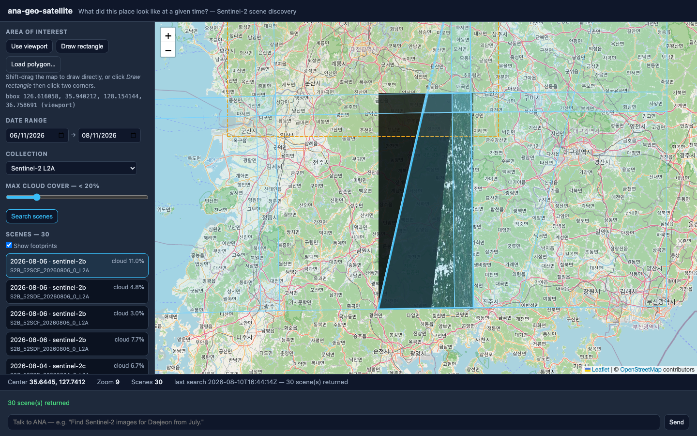

# ana-geo-satellite

Search a public Sentinel-2 catalog for what a satellite recorded over a place and a time window, and put one of those scenes on the map — by **watching and talking**.



**Core question:** *What did this place look like at a given time?*

## Run

```bash
node server.js          # dashboard + state + chat bridge + STAC proxy  → http://localhost:8806
node relay.js           # inbound relay (separate process) — pushes chat to the ANA session
```

Requires **Node.js >= 20 LTS**. Zero npm dependencies (Leaflet is vendored in `vendor/leaflet/`).

To act as ANA, run a coding agent (e.g. Claude Code) in this directory; it receives user messages from `relay.js` output (or `data/inbox.log`), edits `state.json` / the app code, and replies with `POST /api/agent`.

## Dependencies

- Node.js >= 20 LTS (global `fetch`)
- Leaflet 1.9.4 (vendored)

No Python, no API key, no account.

## External data sources

- **Earth Search** — `https://earth-search.aws.element84.com/v1`, collection `sentinel-2-l2a` (default, fixed for v1; `sentinel-2-c1-l2a` selectable). Keyless STAC search.
- **Sentinel-2 L2A assets** — `sentinel-cogs.s3.us-west-2.amazonaws.com`, public `https://` (no requester-pays `s3://`).
- OpenStreetMap raster tiles (basemap only; © OpenStreetMap contributors)

Both external hosts are allowlisted in `server.js` and reached only through `/api/proxy`; the browser never calls them directly. The asset host must be allowlisted alongside the catalog host — the `thumbnail` hrefs Earth Search returns point at the `sentinel-cogs` bucket, so a catalog-only allowlist makes every preview 403.

## Example prompts

```text
"Find Sentinel-2 images for Daejeon from July."
"Only show images with less than 10% cloud."
"Sort by lowest cloud cover."
"Select the clearest scene and show its preview."
"Search the area I'm looking at right now."
"Show this scene at full resolution."   ← evolution: ANA proposes a code change
"Add Sentinel-1 support."               ← evolution: ANA proposes a code change
```

## Current capabilities

AOI from the current viewport, from a rectangle drawn by shift-dragging the map or clicking two corners, or from a loaded GeoJSON polygon (reduced to its bbox). Date range, collection and maximum cloud cover drive a keyless STAC search through the server proxy. Results appear as scene footprints on the map and as a scene list showing datetime, platform, cloud cover, scene ID, collection and the full asset key list. Selecting a scene — from the list, from a footprint click, or by ANA writing `selection.activeSceneId` — makes it active and lays its `thumbnail` asset over the map as a toggleable image overlay. Everything lives in `state.json` and syncs to every connected device through `stateVersion` polling; each search records its provenance in `analysis.lastSearch`.

## Limitations

- **No time-series comparison.** The app shows one scene at a time; it cannot align two dates, difference them, or say what changed. That is the next app.
- **Preview fidelity is scene-level, not analysis-grade.** The `thumbnail` asset is 343×343 px over a ~111 km scene — roughly **325 m per pixel**. It answers "was it cloudy, was the river high" and nothing finer.
- **The preview is placed on `item.bbox`, not on the footprint.** The scene footprint is a reprojected quadrilateral while `L.imageOverlay` accepts only an axis-aligned rectangle, so corner misalignment of up to a few kilometres is expected and accepted at this fidelity (PRD §20.3, FR-SAT-010). Measured on a real Daejeon scene: **1.1–2.6 km** at the corners. The tilted footprint outline is drawn on top so the offset stays visible rather than hidden.
- **Full-resolution band rendering is out of scope for v1** (PRD §20.5). Asking for it is an evolution request, not a bug.
- **A loaded AOI polygon is used as its bounding box**, since §20.4 fixes `bbox` as the search parameter — a narrow polygon will match scenes that only touch its bbox.
- **Cloud cover is the scene-wide figure** reported by the provider. A scene at 5% can still be entirely clouded over your AOI.
- Search results are capped at 50 scenes per query; paging through `numberMatched` beyond that is not implemented.
- When several devices are connected, a `requestId` bump makes each of them run the same STAC search independently. They converge on the same result, but the query is issued more than once.

## Next evolution

**`ana-geo-satellite-change-detection`** — *"What changed over time?"* Takes two scenes instead of one and adds raster alignment, index differencing and thresholding in a Python worker (PRD §8.5), turning scene browsing into temporal analysis.
