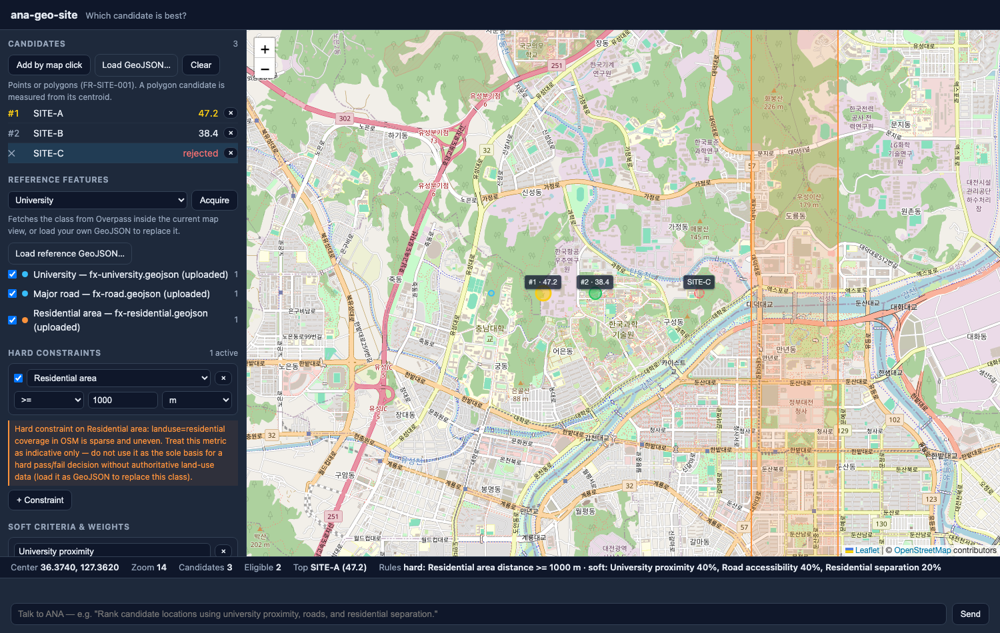

# ana-geo-site

Multi-criteria site selection over real OpenStreetMap features: **define candidates, gate them with hard constraints, weigh the rest against each other, and get a ranking that explains itself.**



Gold is rank #1, green is ranked, red is rejected by a hard constraint; the orange reference layer is the one that constraint depends on.

**Core question:** *Which candidate is best?*

## Run

```bash
node server.js          # dashboard + state + chat bridge + Overpass proxy → http://localhost:8804
node relay.js           # inbound relay (separate process) — pushes chat to the ANA session
```

Requires **Node.js >= 20 LTS**. Zero npm dependencies (Leaflet and Turf.js are vendored). No Python.

To act as ANA, run a coding agent (e.g. Claude Code) in this directory; it receives user messages from `relay.js` output (or `data/inbox.log`), edits `state.json` / the app code, and replies with `POST /api/agent`.

Offline check of the whole scoring pipeline, without a server or network:

```bash
node tools/smoke_scoring.mjs
```

## Dependencies

- Node.js >= 20 LTS (global `fetch`)
- Leaflet 1.9.4 (vendored at `vendor/leaflet/`)
- Turf.js 7 (vendored at `vendor/turf/turf.min.js`) — version 7.3+ specifically, for `pointToPolygonDistance`

## External data sources

- **Overpass API** (`overpass-api.de`) for OpenStreetMap reference features, reached only through the server's allowlist proxy — the browser never calls it directly. Each acquisition is recorded in `state.provenance`.
- OpenStreetMap raster tiles (basemap only; © OpenStreetMap contributors)
- **Your own GeoJSON**, on two paths: as candidates (points or polygons), and as reference features, where an uploaded file replaces an OSM class outright. That is the route for authoritative land-use, cadastral or infrastructure data.

Two acquisition choices are worth knowing before you trust a number:

- **`road` means major roads only** — `highway~"^(motorway|trunk|primary|secondary)$"`. Unfiltered `highway=*` pulls in residential streets, service roads and driveways; on a small Daejeon window that overflows the 2,000-feature cap more than tenfold, and a truncated set silently turns "distance to a road" into "distance to whichever roads fit". The four trunk grades return 548 ways on the window `[127.360, 36.340, 127.420, 36.390]`.
- **⚠️ `residential` is `landuse=residential`, and OSM coverage of it is sparse and uneven.** Absence of a polygon is not evidence of absence of housing. The app shows this warning next to any hard constraint that uses the class, and it means it: **do not let a pass/fail decision rest on this metric alone.** Load authoritative land-use data as a reference GeoJSON to replace it.

## Example prompts

```text
"Rank candidate locations using university proximity, roads, and residential separation."
"Residential areas within 1 km should be rejected entirely."
"Road access is the most important factor — raise its weight to 50%."
"Add distance to a substation as a new criterion."
"Rank only the candidates larger than 20,000 square metres."
"Why did site-b lose?"
"Rank them by drive time to the nearest hospital instead of straight-line distance."   ← evolution: ANA proposes a code change
```

The first six map onto the constraint/criteria model directly. The last one asks for travel time, which this app cannot measure — so ANA proposes adding it (see `SPEC.md` §14).

## Current capabilities

Drop candidate points on the map or load a GeoJSON file of points and polygons. Acquire reference features — universities, schools, major roads, residential, commercial and industrial areas, power lines, substations, railway stations, parks, water — from Overpass inside the current view, or upload your own.

Then define the decision in two separate halves, as PRD §18.2 requires:

- **Hard constraints** are pass/fail: `residentialDistance >= 1000 m`, `area >= 20000 m²`. A candidate that fails one keeps its metrics and its score but takes no rank, and says which rule rejected it.
- **Soft criteria** produce a 0–100 score each, from a raw metric and a `best`/`worst` pair — `best` scores 100, `worst` scores 0, values outside them clamp. Which end is "best" is implied by the bounds, so a criterion cannot contradict itself. Each criterion carries a weight; the sum is always on screen and must be 1.0.

Distances are measured with Turf.js from the candidate to the nearest reference feature's actual geometry: a point uses `distance`, a road line uses `pointToLineDistance`, an area uses `pointToPolygonDistance` — so "1 km from a residential area" means 1 km from its edge, not from its centre.

The result is the PRD §18.4 model per candidate — metrics, criterion scores, weighted score, rank — plus the breakdown behind it:

```text
This site ranked #1 because:
- University proximity: 80
- Residential separation: 76
- Road accessibility: 20
```

Every rule is editable one field at a time, by you or by ANA, and the whole model is plain JSON in `state.json`.

## Limitations

- **No connectivity reasoning.** Every metric is a straight line. The app can tell you a candidate is 200 m from a major road; it cannot tell you whether anything connects to it, how long the drive is, or that a river runs between the two. A site scoring well on "road accessibility" may have no access at all. That is the next app.
- Weights are validated but not sanity-checked — nothing stops you weighting a criterion whose reference class you never acquired at 90%, beyond the error you get when the run refuses.
- A polygon candidate is measured from its centroid, so a large parcel is treated as a point.
- Normalization uses fixed `best`/`worst` bounds, not the spread of the actual candidates; two candidates 5 m apart can score identically.
- OSM relations become a single point at their bounding-box centre; their member geometry is not stitched.
- Reference sets are capped at 2,000 features per class (PRD §26.1); a truncated set is flagged, because the metric would otherwise measure to a partial set.
- The public Overpass endpoint is frequently busy and rate-limits successive queries; failures are reported in plain language, and the fix is usually to wait a few seconds, zoom in, and retry.
- Everything runs in the browser, so 500 candidates × 2,000 reference features is noticeably slow on a laptop; candidates are capped at 500 per run.
- No slope, no solar irradiance, no cadastral data — PRD §18.6 keeps those optional, and the GeoJSON reference upload is the way in.
- Approval cards render as plain feed messages in this first version.

## Next evolution

**`ana-geo-route`** — *"How do I get there?"*

```text
Current:
ana-geo-site

Question:
"Which candidate is best?"

Limitation:
Can rank candidates by straight-line proximity, but cannot reason about connectivity —
whether a road actually reaches a site, or how long the journey takes.

Next:
ana-geo-route

New capability:
Street-network routing, travel time, and isochrones over a real road graph.
```
